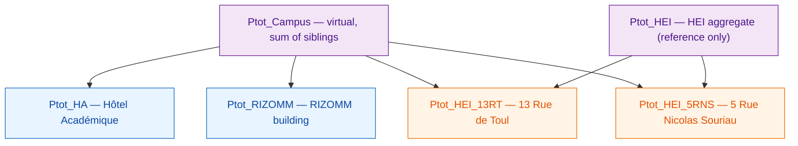
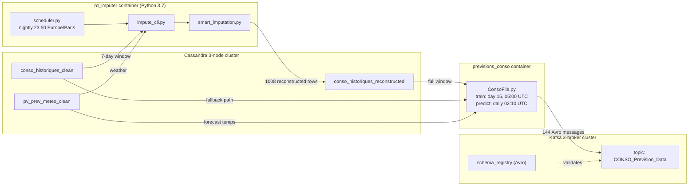

# 1. Overview

## 1.1 What this project is

Project N°28 is an R&D deliverable inside the **LiveTree demonstrator** at JUNIA (Lille, France). The demonstrator is a physical set of campus buildings instrumented with electrical meters, a Cassandra database that stores their consumption history, and a Kafka bus that broadcasts forecasts to downstream consumers (dashboards, energy-management services).

At the core of the demonstrator is a **day-ahead electricity consumption forecaster**: every morning it publishes 144 predicted values (one every 10 minutes, 24 hours of coverage) for each monitored building.

Project N°28 has two responsibilities:

1. **Keep the forecaster producing, even when the acquisition chain breaks.** A single missing row in the 7-day input window used to be enough to stall predictions. The imputation module bridges those gaps.
2. **Explain every value that is published.** Each imputed point carries a quality flag and a routed strategy so operators can tell synthetic data apart from real measurements.

## 1.2 Why it exists

The input to the prediction model is the **last 7 days of 10-minute-interval consumption** — that is 144 × 7 = **1008 data points** per building. In production this window is assembled from Cassandra once per day.

Real-world observations over the past year showed:

- Sensors or network links drop out for **minutes to days**.
- The legacy pipeline rejected any window containing fewer than 850 valid rows.
- When it ran anyway, it used a naive linear interpolation that breaks down on multi-hour gaps spanning weekends, holidays, or sharp weather transitions.

The imputation module fixes both problems by (a) reconstructing any gap size from 1 point up to the full 1008-point window and (b) routing each gap to the strategy that best matches its context (day-of-week, occupancy, season, thermal regime, peer meter availability).

## 1.3 What it produces

Per building, per day:

| Artefact | Rows | Columns | Destination |
|----------|------|---------|-------------|
| Reconstructed 7-day window | 1008 | `timestamp`, `value`, `quality` | Cassandra table `conso_historiques_reconstructed` + CSV at `/io/reconstructed_<building>_<date>.csv` |
| Optional overlay plot | — | — | PNG at `/io/reconstructed_<building>_<date>.png` |
| Audit log | — | JSON | `/io/audit_logs/imputation_audit_<run-id>.json` |
| Day-ahead consumption forecast | 144 × 5 buildings | `Ptot_HA_Forecast`, `Ptot_HEI_13RT_Forecast`, `Ptot_HEI_5RNS_Forecast`, `Ptot_RIZOMM_Forecast`, `Ptot_Ilot_Forecast`, `Date` | Kafka topic `CONSO_Prevision_Data` (Avro) |

Quality flags are:

- `0` — real measurement, left untouched.
- `1` — filled by linear interpolation (short gap).
- `2` — filled by a contextual strategy (template, peer correlation, safe-median blend).
- `3` — filled by an ML-derived or multi-week donor-day strategy (MICE, Kalman, KNN, multi-week template, safe median).

## 1.4 Buildings covered

- **Entry meters** (blue): top-of-building meters with no parent. They get the strongest routing protection because they anchor the whole hierarchy.
- **Sub-meters** (orange): sit under a parent. When a sub-meter has a gap but its parent does not, the imputer can reconstruct it from the parent via the learned peer ratio.
- **Virtual channels** (purple): not stored as their own meter. `Ptot_Campus` is computed at query time as the sum of the four entry/sub-meters. `Ptot_HEI` is only used internally to build the peer ratio for 13RT and 5RNS.

## 1.5 Where it runs

Both the imputer and the predictor run as long-lived Docker containers inside the demonstrator's Kafka/Cassandra network. Neither one is exposed to the public internet.

## 1.6 Non-goals

The following are explicitly **out of scope** for the imputation module and therefore not documented here:

- Raising sensor faults upstream. Gap detection is reactive: the imputer reconstructs the data it is handed, and writes a correction record when a raw reading is implausible, but it does not trigger maintenance tickets.
- Retraining the prediction model on reconstructed data. The predictor consumes the reconstructed table, but its training loop runs against the raw `conso_historiques_clean` table to avoid a feedback loop.
- Real-time streaming. The pipeline is nightly-batch; the unit of work is always a 7-day window.
