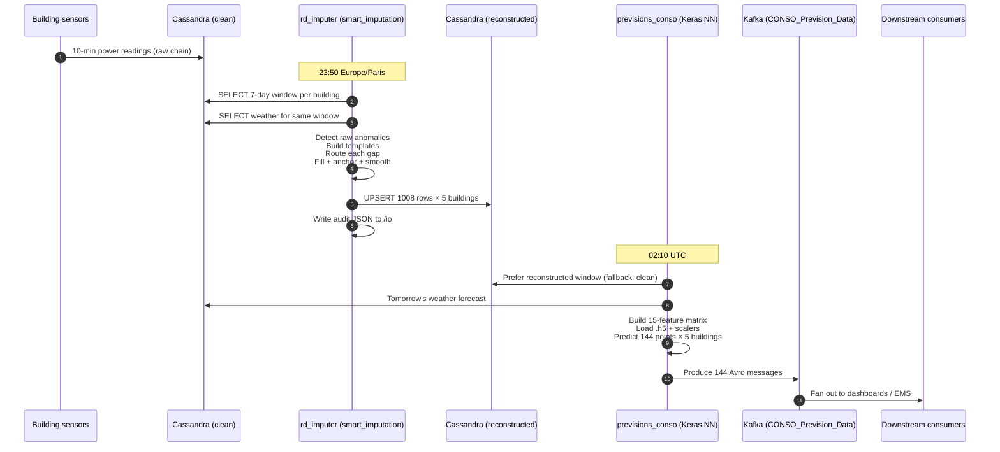
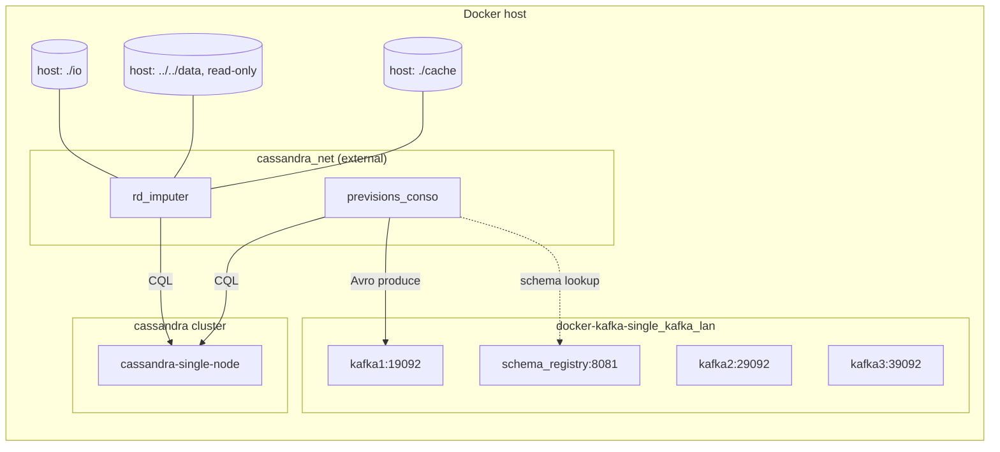

# 2. Architecture

This document is a map of the repository and the runtime. Read [`01-overview.md`](01-overview.md) first for the business-level picture.

## 2.1 Repository layout

```
LiveTree-RandD-project/
├── README.md                         # Quick-start for running the stack
├── ARCHITECTURE.md                   # Platform-team architecture reference
├── docs/                             # You are here. Deep documentation.
│
├── data/                             # Reference CSVs and holidays used in dev + tests
│   ├── 2023 -2025.xlsx
│   ├── 2026 historical data.csv
│   ├── 2026 forecast data.csv
│   ├── 2026 weather data.csv
│   ├── Cons_Historical Site_2026-03-22_2026-04-10.csv
│   ├── Cons_Hotel Academic_2026-03-22_2026-04-10.csv
│   ├── Consumption_2021.xlsx
│   ├── Consumption_2022.xlsx
│   └── Holidays.xlsx
│
├── Imputation-Module/
│   ├── src/                          # Pure-Python package, no framework
│   │   ├── config.py                 # Paths, table names, buildings, timezone
│   │   ├── window.py                 # Slice 7-day window out of a dataframe
│   │   ├── cassandra_client.py       # Pull/push against Cassandra
│   │   ├── imputer.py                # Thin adapter around smart_imputation
│   │   ├── smart_imputation.py       # ExtendedDeploymentAlgorithm — the engine
│   │   ├── impute_cli.py             # argparse entrypoint
│   │   ├── scheduler.py              # APScheduler daemon (nightly cron)
│   │   └── plot_reconstruction.py    # Matplotlib overlay rendering
│   ├── cassandra/
│   │   └── schema.cql                # DDL for conso_historiques_reconstructed
│   └── docker-imputation/
│       ├── Dockerfile                # Python 3.7-slim, installs the src/ package
│       ├── docker-compose.yml        # rd_imputer service + volumes
│       ├── requirements.txt
│       ├── run-all-buildings.sh
│       └── README.md
│
└── Prediction-Model/
    └── docker-previsions-conso/
        ├── docker-compose.yml        # previsions_conso service
        └── build/previsions_conso/
            ├── Dockerfile            # Python 3.7 + TensorFlow + confluent_kafka
            └── code/
                ├── ConsoFile.py      # Training + prediction, scheduled
                ├── Holidays.xlsx     # Legal / close-day calendar
                ├── my_modelCons*.h5  # Trained Keras models (one per building)
                ├── my_modelCons3*.h5 # Next-generation models saved by TrainNNCons
                ├── scalerConso*.save # MinMaxScaler for targets (joblib)
                ├── scalerxConso*.save# MinMaxScaler for features (joblib)
                ├── requirements.txt
                └── certificates + keys (ca-cert, *.pem, *.key)
```

## 2.2 Component responsibility matrix

| Component | Runs where | Input | Output | When |
|-----------|------------|-------|--------|------|
| `cassandra_client.py` | Inside imputer container | `conso_historiques_clean`, `pv_prev_meteo_clean` | In-memory DataFrames | On each imputation run |
| `window.py` | Inside imputer container | Full history DataFrame + target date | 1008-row tz-naive local-time window | On each imputation run |
| `smart_imputation.ExtendedDeploymentAlgorithm` | Inside imputer container | A DataFrame with gaps | A fully-filled DataFrame + audit log | On each imputation run |
| `imputer.impute()` | Inside imputer container | A pandas Series + timestamps | (filled series, quality Series) | Per-building, per-run |
| `impute_cli.py` | Inside imputer container | CLI args | CSV + optional PNG + Cassandra upsert | 1× per building × 1× per night |
| `scheduler.py` | Inside imputer container | — | Subprocesses `impute_cli.py` | APScheduler cron: 23:50 Europe/Paris |
| `ConsoFile.py` :: `TrainNNCons` | Inside predictor container | Last 400 days from Cassandra | `.h5` Keras models + `.save` scalers | APScheduler cron: day-15 of month, 05:00 |
| `ConsoFile.py` :: `MakePredConso` | Inside predictor container | Last 7 days from Cassandra + tomorrow's weather forecast | 144 Avro messages on Kafka | APScheduler cron: 02:10 daily |

## 2.3 End-to-end data flow



The imputer and predictor run in separate containers and share nothing but the Cassandra and Kafka clusters. Both use `Europe/Paris` for wall-clock scheduling and convert to UTC when talking to storage.

## 2.4 Key design decisions

### 2.4.1 10-minute grid, 1008 rows, 7-day window

Every internal function assumes the input is resampled onto a **strict 10-minute grid**. Missing timestamps become NaN rows (see `window.extract_window` reindex logic in [`imputation/02-file-reference.md`](imputation/02-file-reference.md#23-windowpy)). This lets the gap detector treat "sensor outage" and "no row written" uniformly: both show up as NaN.

144 points/day × 7 days = 1008 rows. The prediction model was trained on that exact window, so the imputer is configured to deliver precisely 1008 rows in that exact order. `impute_cli.py` validates this at ingest and fails fast on a miscount.

### 2.4.2 56-day history prepend

Before any gap is filled, the imputer extends the 1008-row window backwards with up to 56 extra days of historical context (`_PREPEND_DAYS = 56` in `imputer.py`). This extended frame is what the algorithm actually reads. The extension is trimmed off before the quality flags are assigned back to the caller.

Why 56 days? Two reasons:

- **Weekly templates** inside `smart_imputation.py` need several occurrences of each (day-of-week, hour) cell to build a stable median. A 28-day base lookback requires at least ~28 days of context; adding margin yields 56.
- **Seasonal templates** break down below ~30 samples per (season, day-of-week, hour) cell. 56 days of context, combined with the algorithm's seasonal blending, is enough to populate most cells after a few weeks of real data.

Without the prepend, any gap longer than ~1 day would fall through to the safe-median fallback.

### 2.4.3 Nightly batch, not streaming

Prediction runs once per day. Imputation runs once per day, ~3 hours before. A streaming design was rejected because the forecast granularity is 24 h and the observed outages are hours to days, not seconds; batch is simpler, cheaper, and easier to audit.

### 2.4.4 Per-building isolation

Each nightly run invokes `impute_cli.py` **once per building**. A crash in one building's run does not abort the others (see `scheduler.run_daily_imputation`). The reconstructed table has one quality column per building so sibling buildings are never overwritten by a partial rerun.

### 2.4.5 Reconstruction is idempotent

Re-running the imputer for the same `target_date` overwrites the same `(name, Date)` primary keys in `conso_historiques_reconstructed`. Stale CSV and PNG artefacts in `/io/` are wiped at the start of each batch by `_wipe_previous_outputs`.

## 2.5 Service topology (container view)



- **`cassandra_net`** — the external Docker network that already exists in the demonstrator. Both the imputer and the predictor attach to it. The Kafka broker is accessible on the same network in production; locally the predictor joins `docker-kafka-single_kafka_lan` as well.
- **Volumes** — the imputer mounts `../../data` read-only (so dev-fixture CSVs never get clobbered), writes output CSVs/PNGs/audit logs to `/io`, and caches intermediate pickle files to `/app/cache`.

## 2.6 Configuration surface

Environment variables that change behaviour:

| Variable | Default | Consumed by | Effect |
|----------|---------|-------------|--------|
| `CASSANDRA_HOSTS` | `127.0.0.1` | `config.py` | Comma-separated list of contact points |
| `CASSANDRA_USERNAME` / `CASSANDRA_PASSWORD` | empty | `cassandra_client.py` | If set, switches to `PlainTextAuthProvider` |
| `CASSANDRA_KEYSPACE` | `previsions_data` | `config.py` | Keyspace to connect to |
| `IMPUTER_DATA_DIR` | `<repo>/data` (dev), `/data` (prod) | `config.py`, `smart_imputation.py` | Where holiday CSVs and reference CSVs live |
| `IMPUTER_RECENT_HA_CSV` | `Cons_Hotel Academic_2026-03-22_2026-04-10.csv` | `config.py` | Dev-only CSV used as fallback history for Ptot_HA |
| `IMPUTER_OUTPUT_DIR` | `<imputer>/src/output` | `config.py` | Root for per-run artefacts |
| `IMPUTER_AUDIT_LOG_DIR` | `<OUTPUT_DIR>/audit_logs` | `config.py` | Where the JSON audit log lands |
| `SCHEDULE_HOUR` | `23` | `scheduler.py` | Cron hour in Europe/Paris |
| `SCHEDULE_MINUTE` | `50` | `scheduler.py` | Cron minute |
| `TZ` | `Europe/Paris` | container | OS-level timezone inside the container |

The predictor has no equivalent environment surface; Cassandra credentials and Kafka brokers are hard-coded in `ConsoFile.py` — see [`prediction/07-known-issues.md`](prediction/07-known-issues.md).
